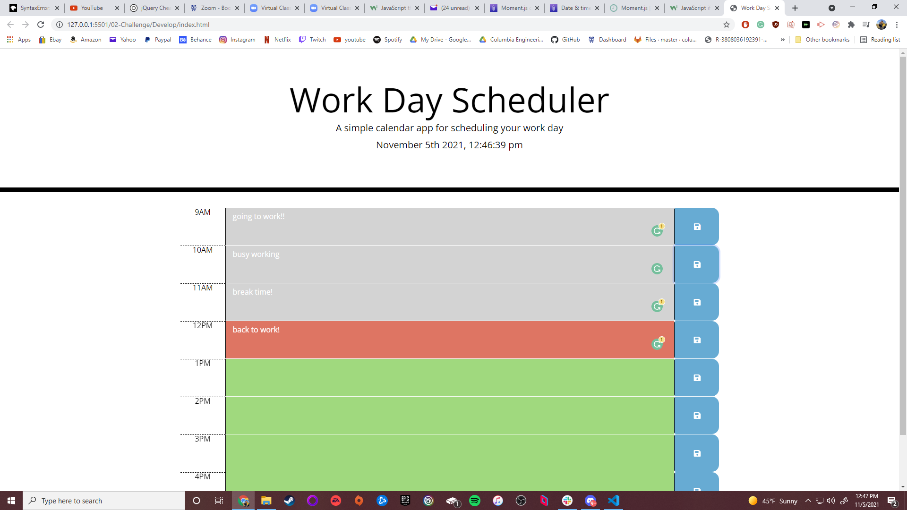

# My-Daily-Planner-Website-App
Hello welcome to my repo! This is where I am showcasing my daily planner website. I will show you why I have created this website, a general overview on how I created it, and most importantly what I learned doing so!

# Why I Created This Website:
I created this website to mainly try and learn how libraries, api-s, and frameworks affect a website and how what are the pros and cons. I wanted to test myself and try to learn how to get better at web-development!

# What I Did To Create This Site:
To start off I used a popular css framework known as cdn bootstrap(along with regular css) to lay the foundation of the html. The foundation was mainly creating time blocks and save buttons to fill out a 9am-5pm work schedule. I felt like cdn bootstrap was perfect for this project because it is quick and easy to layout all the html I needed. The main con from what I can tell is that the css might look generic and will lack my "personal touch" however like I said it was so fast to create the layout that I can see for projects like this bootstrap will be preferred. I started off by making the save feature work so after (I used the jquery for javascript library) I made a js file and made sure to link it in the html header, defering the script that way it loads first and fires when the website is ready. Back to the save feature, I found out through console what to target that way when I click the save button it saves in localstorage. The main issue was getting that to be retrived and permanetly stay on the page. I found out that I had to create a function in the main global function that filtered through the class I assigned to the html textarea tag (it was called description) that way I can get the local storage item that I saved and place it into the text tag using the .text jquery function. That was honestly the hardest part of this project in my opinion. Once I had that done I used jquery to select an id called currentDay then I used moment js to turn that id into what the month, day, year, and current time is. That way when you open the site you see and known everything you need to know to help create whatever plans you need to make. The other hard part was color coding all the time blocks. I used jquery but mainly more moment js to set the time to 8:40am then I used Math.ceil to round up the nearest integer which would end up being 9am. Then I used of moment js functions (it goes in order) known as duration to set the time between 2 hours (in this case 9am-10am), diff to create a difference between hour sets (which each hour set will stop at 0 and later sets will end up as negative values) and lastly I used asHours function to just keep continuing after each set and wouldn't just stop at 9am-10am. I made sure to also make htis into a string that way I can parseInt it later that way I can gaurentee it shows up as a number. I am not sure if that was exactly needed but reading through moment js I couldn't get a clear answer so I kept it as is being safe just incase.And then I created a series of if and else if statments making sure to color code what was in the past and what was in the present. Making sure to add the correct css classes. Lastly I added an else statement saying if both are not true then add a class representing those time blocks as the future. To topic all off I went back to the save function where I created the localstorage set item and added a simple function that when you click the save button it will notify you when you saved what you entered. I made sure it will last and be visible up to 2 seconds and then disappear. I feel like these libraries and api-s are really useful and the only con I can see is that you have to really read their documentation to see how they work but it gives you access to create websites that you really can't do in vinalla javascript.

# What I learned From Making This Website:
I really learned how using frameworks, libraries, and api-s are really powerful and can really help you create exactly what you need with the ease (or easier than trying to create that by yourself). I feel like this also help me learn to read the documentation to see what I can really do/what I need it to do and really see the power of these libraries, etc. It can be overwhelming but what you need is all there in the documentation and for it was honestly really helpful to try and find what I really needed and to ignore what I didn't need. This was definitely good practice because I know in the future I probably won't use exactly these particular libraries, etc but I will need to use something like this in the future and it's good to learn how the process works now then later. I also feel like I am getting a better grasp at formatting my code neatly and giving detailed comments. I am not sure If I made them too detailed but personally I rather have them over detailed then little to no detail that way I can learn and know almost exactly what is really going on and hopefully it isn't too overwhelming for someone else viewing and rather more than enought to understand too. At the end of the day I have made something that I am proud of.
